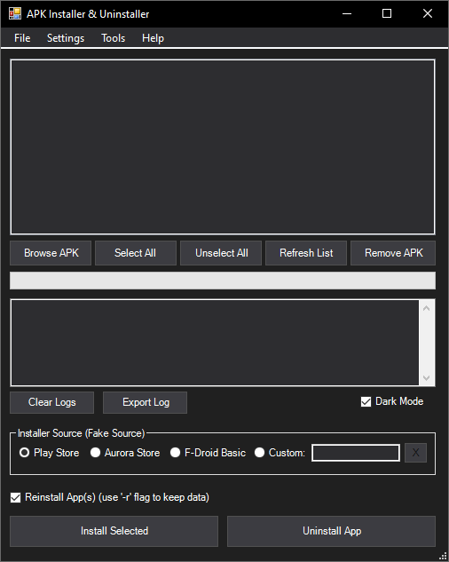
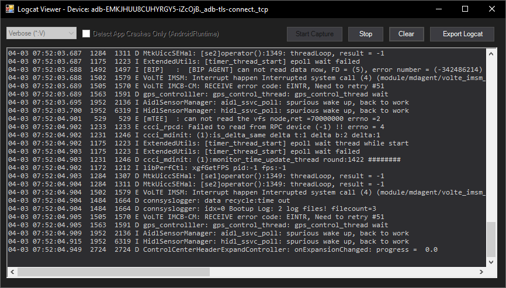
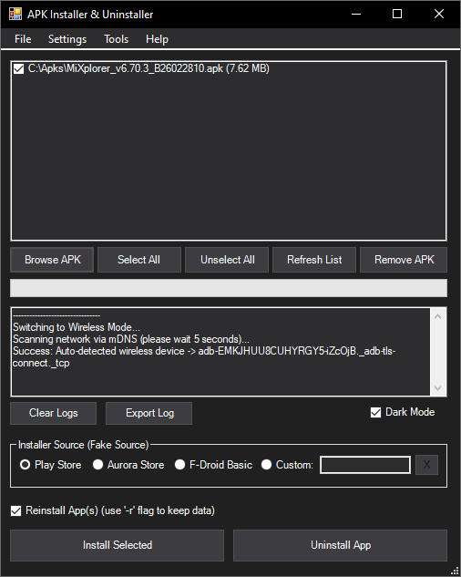
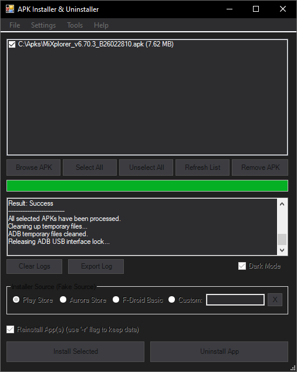

# App Installer & Uninstaller


A lightweight, portable Windows GUI utility built in PowerShell to easily manage Android apps and app bundles via Android Debug Bridge (ADB). 

This tool gives you a clean graphical interface for common ADB operations—like wireless debugging, logcat monitoring, batch installations, and system app debloating—without the hassle of typing manual command-line inputs.

## 📸 Screenshots

| Main Interface (Dark Mode) | Logcat Viewer |
| :---: | :---: |
|  |  |
| **Wireless Pairing** | **Install Progress** |
|  |  |

## ✨ Features

* **Graphical Interface:** A WinForms-based GUI that handles ADB operations in the background, keeping the interface completely responsive.
* **Logcat Viewer:** Real-time log monitoring with standard level filtering (Verbose, Debug, Info, Warning, Error, Fatal) and a dedicated App Crash Detection mode (`AndroidRuntime:E`). Logs can be quickly exported to a text file.
* **Wireless Debugging:** Connects to Android 11+ devices via mDNS over local Wi-Fi. It includes a manual IP fallback and a secure pairing dialog for unauthenticated devices.
* **Device Targeting:** Automatically routes commands to the correct device based on your active connection mode (USB or Wireless).
* **Batch Installation:** Install multiple `.apk` files sequentially. It uses temporary GUID proxy filenames to prevent Android shell syntax errors when installing files with spaces or special characters.
* **Drag-and-Drop:** Add APK files to your queue easily by dragging them straight from Windows Explorer.
* **Uninstaller Options:**
  * **Standard:** Completely removes the app and its data.
  * **Keep Data:** Uninstalls the app but preserves user data (`-k` flag).
  * **System App:** Uninstalls OEM bloatware for the current user (`--user 0`). No root required.
  * **Disable App:** Hides and disables apps (useful for bypassing strict Xiaomi/Oppo OS restrictions).
* **Fake Installer Sources:** Spoofs the installation source (e.g., Play Store, Aurora Store, F-Droid Basic). Custom package names are completely supported and saved automatically for your next session.
  > **⚠️ Note:** Aurora Store and F-Droid Basic require their respective apps to be installed on your device beforehand to be recognized as valid sources. If you don't want to use them, you can simply spoof the default Android Package Installer. Just copy and paste the following package name into the **Custom** field:
  > ```text
  > com.google.android.packageinstaller
  > ```
* **Dark Mode:** Built-in toggle for a dark theme interface.
* **Process Management:** Automatically terminates the ADB daemon after tasks are completed to allow safe USB ejection. Cleans up temporary proxy files and background processes when closed to ensure zero memory leaks.
* **Bundle Support:** Natively process and install `.apk`, `.apkm`, `.xapk`, `.apks`, and raw `.zip` files! It automatically extracts them in the background, pushes the split packages via `install-multiple` adb command, and even auto-pushes OBB data if detected.

> [!WARNING]
> **📦 Wait, what about `.aab` (Android App Bundle) files?**
>
> You might see developers drop `.aab` files in their GitHub releases. This tool **intentionally ignores** them. Why? Because an `.aab` is a raw "blueprint" format meant for the Google Play Store servers, not your phone. Your Android device literally doesn't know how to install it directly!
>
> To install an `.aab` using this tool, you need to compile it into an `.apks` file first using Google's official `bundletool`.
>
> **Here's a quick tutorial on how to convert it:**
> 1. Make sure you have Java (JRE or JDK) installed on your PC.
> 2. Download the latest `bundletool.jar` from [Google's GitHub](https://github.com/google/bundletool/releases).
> 3. Put your `.aab` file and `bundletool.jar` in the same folder.
> 4. Open your terminal/command prompt in that folder and run this exact command:
>    ```cmd
>    java -jar bundletool.jar build-apks --bundle=your_app.aab --output=your_app.apks --mode=universal
>
> 5. You now have a compiled `your_app.apks` file. Just drag and drop that into the tool, and it will install flawlessly!
>

## 🚀 Download & Run

You do not need to install any PowerShell development tools to use this application.

1. Download the latest `.exe` binary from the **[Releases Page](https://github.com/chihafuyu/APK-Installer-Uninstaller/releases)**.
2. Ensure `adb.exe` is in your system PATH. If you don't have it installed, don't worry—the tool will automatically download and configure it for you!
3. Enable **USB Debugging** or **Wireless Debugging** on your Android device and connect it to your PC.
4. Run the executable.

> **⚠️ Security Note:** Because the executable is compiled from a PowerShell script (via PS2EXE), Windows SmartScreen or antivirus software might flag it as a false positive. You can safely click "More info" -> "Run anyway", or just add it to your antivirus exclusions.

## 🛠️ Build from Source

If you prefer to compile the executable yourself:

### Prerequisites
1. Windows OS with Windows PowerShell 5.1 or later.
2. The **[PS2EXE](https://github.com/MScholtes/PS2EXE)** module. If you don't have it installed, simply open PowerShell as Administrator and run this one-line command:

   ```powershell
   Set-ExecutionPolicy -ExecutionPolicy RemoteSigned -Scope CurrentUser -Force; Install-Module ps2exe -Scope CurrentUser -Force

### Compilation Steps

1. Clone this repository:
   ```cmd
   git clone https://github.com/chihafuyu/APK-Installer-Uninstaller.git
   ```
2. Navigate to the directory containing the cloned script:
   ```powershell
   cd .\path\to\cloned\repo
   ```
3. Run the compilation command. The `-noConsole` flag is strictly required to hide the background terminal window and prevent stray output boxes:
   ```powershell
   Invoke-PS2EXE .\APK-Installer-Uninstaller.ps1 .\ADB-APK-Installer.exe -noConsole -title "APK Installer & Uninstaller" -version "1.0.0.0"
   ```
   
   _(Optional: You can add a custom icon by appending `-icon .\logo.ico` to the command above)._
   
4. The compiled `.exe` binary will be generated in the same directory.
   
## 📝 License

This project is created by **chihafuyu** and is open-sourced under the **[MIT License](https://opensource.org/licenses/mit)**.

**Copyright (c) 2026 chihafuyu**

Basically: you are free to use, modify, and distribute this software for any purpose, as long as you keep the original copyright notice above. It is provided _"as is"_, without warranty of any kind. Use it at your own risk!